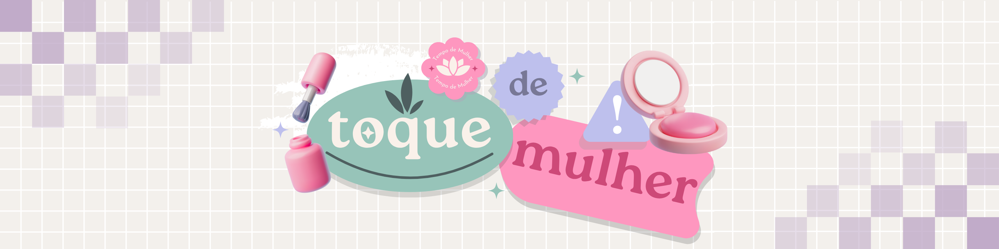

  

# 💄 Toque de Mulher

**Organização dedicada ao desenvolvimento do ecossistema digital da loja Toque de Mulher.**  
Aqui você encontra os repositórios e documentações relacionados ao e-commerce da marca.

## 📌 Sobre

Um sistema completo de e-commerce para a loja Toque de Mulher, com as seguintes funcionalidades:

- Interface web dividida entre cliente (admin) e usuário final.
- Automatização de processos: controle de estoque, pedidos e atendimento.
- Integração de métodos de pagamento e gerenciamento de usuários.
- Design responsivo com identidade visual personalizada.
- Backend robusto com autenticação, banco de dados e APIs RESTful.

## 🎯 Por que este projeto?

Atualmente, a loja opera de forma física e manual, o que limita o alcance e a eficiência da operação. Este projeto busca:

- Digitalizar os processos de venda e atendimento.
- Expandir o alcance da marca no mercado online.
- Reduzir o tempo gasto com tarefas operacionais.
- Oferecer uma experiência de compra moderna e acessível.

## 🌐 Onde o projeto está sendo desenvolvido?

- **Código-fonte e repositórios:** [GitHub](https://github.com)
- **Documentação técnica:** [`Google Docs`](https://docs.google.com/document/d/1z5q9DrDMNDiX6jN4TAneIHm9j3ENk4r6LJFaLApvh0U/edit?usp=drivesdk) [`Docs`](https://github.com/ToqueDeMulher/docs)
- **Planejamento e tarefas:** [`Github Projects`](https://github.com/orgs/ToqueDeMulher/projects/2)

---

### 📂 Estrutura dos Repositórios

| Repositório      | Descrição                                     |
|------------------|-----------------------------------------------|
| `ToqueDeMulher-Develop` | Repositório central do desenvolvimento — inclui frontend e backend integrados |
| `.github`         | Configurações, templates e automações do repositório    |
| `docs`            | Documentação técnica e de projeto                       |
| `license`         | Arquivo de licença e termos de uso                      |

## 📅 Milestones

- **Status atual:** Em desenvolvimento  
- **Entrega do MVP:** Dezembro de 2025

<h2 id="autores">✍️ Autores</h2>

<table align="center">
  <tr>
    <td align="center">
      <a href="https://github.com/marichoii">
        
         
        <b>Maria</b>
         
      </a>
        Gerente do Projeto, DevOps, Fullstack, QA
    </td>
    <td align="center">
      <a href="https://github.com/GuHenriquee">
        
         
        <b>Gustavo Henrique</b>
         
      </a>
        Dev Backend, Dev Frontend, Modelador de Dados
    </td>
    <td align="center">
      <a href="https://github.com/Jpzin1">
        
         
        <b>João Pedro</b>
         
      </a>
        Dev Frontend, Dev Backend, Fullstack
    </td>
    <td align="center">
      <a href="https://github.com/joaodelabio">
        
         
        <b>João Gabriel</b>
         
      </a>
        Dev Backend, Dev Frontend, Designer UI/UX
    </td>
  </tr>
  <tr>
    <td align="center">
      <a href="https://github.com/MatheusMusashiTanaka">
        
         
        <b>Musashi</b>
         
      </a>
        Dev Backend, DevOps, Fullstack, QA
    </td>
    <td align="center">
      <a href="https://github.com/ccarolmdlima">
        
         
        <b>Carolina</b>
         
      </a>
        Designer UI/UX, QA
    </td>
    <td align="center">
      <a href="https://github.com/Zouares">
        
         
        <b>Gabriel</b>
         
      </a>
        Dev Frontend, Designer UI/UX, Modelador de Dados
    </td>
  </tr>
</table>

---

## 📬 Contato

📧 **Maria Eduarda de Moura Eguchi** — [LinkedIn](https://www.linkedin.com/in/marichoii/)
