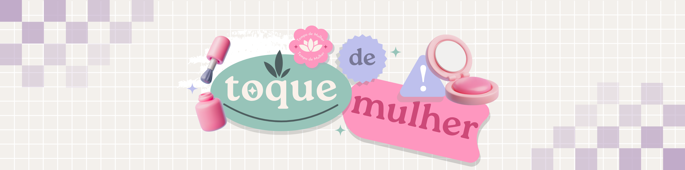

  

# 💄 Projeto de E-commerce: Toque de Mulher
Este repositório contém a documentação e o código-fonte da plataforma de e-commerce desenvolvida para a **Toque de Mulher**, uma loja especializada na curadoria e venda de perfumes importados e maquiagens de prestígio.

O projeto é uma resposta estratégica à necessidade de digitalizar a operação da empresa, que atualmente dedica até 80% do tempo de sua equipe a processos manuais, limitando o crescimento e a capacidade de venda. O objetivo é transformar o modelo de negócio, automatizar processos e expandir o alcance de mercado para os âmbitos regional e nacional.

## 🎯 Objetivos Estratégicos
A plataforma foi projetada para resolver gargalos operacionais e posicionar a **"Toque de Mulher"** em um mercado de e-commerce de beleza em rápida expansão. Os objetivos centrais são:
- **Excelência Operacional:** Reduzir em até 80% o tempo gasto com tarefas manuais de venda e gestão de inventário, liberando a equipe para focar em atividades estratégicas.
- **Expansão de Mercado:** Ultrapassar as barreiras geográficas da loja física para capturar uma nova base de clientes em nível nacional.
- **Diversificação de Receitas:** Estabelecer um canal de vendas digital robusto e escalável para complementar e, futuramente, superar as vendas da loja física.
- **Fortalecimento da Marca:** Consolidar a "Toque de Mulher" como uma autoridade online em cosméticos de prestígio, associando a marca à qualidade, confiança e exclusividade.

## ⚙️ Funcionalidades do MVP
O escopo do projeto está focado em entregar um Produto Mínimo Viável (MVP) robusto, com funcionalidades essenciais divididas em duas interfaces principais.

### Loja Virtual (Interface do Usuário)
- **Gestão de Contas (RF1):** Cadastro, login, edição de perfil e exclusão de conta de forma segura.
- **Catálogo de Produtos (RF3):** Navegação intuitiva por categorias, sistema de busca com filtros avançados (marca, preço, etc.) e páginas de produto detalhadas.
- **Carrinho e Checkout (RF4, RF5):** Carrinho de compras persistente e um processo de checkout simplificado, integrado a um gateway de pagamento seguro.

### Painel Administrativo (Escritório Virtual)
- **Gestão de Produtos e Inventário (RF6):** Ferramentas para adicionar, editar e remover produtos, com controle de estoque automatizado.
- **Gestão de Fornecedores (RF6):** Sistema centralizado para gerenciar informações dos fornecedores.
- **Gestão de Encomendas:** Painel para visualizar e processar todos os pedidos dos clientes.
- **Relatórios e Análises (RF7):** Geração de relatórios de vendas, produtos mais vendidos e receita por categoria.

## 🚀 Tecnologias
A arquitetura da plataforma foi definida para garantir desempenho, escalabilidade e uma base sólida para futuras inovações

| Camada          | Tecnologia        | Justificativa             |
|-----------------|-------------------|---------------------------|
| Frontend        | `React`           | Para criar interfaces de usuário ricas e interativas, com uma arquitetura baseada em componentes que facilita a manutenção e escalabilidade |
| Backend         | `Nodejs`          | Permite alta performance e escalabilidade para gerenciar múltiplas conexões simultâneas, ideal para e-commerce.                             |
| Base de Dados   | `PostgreSQ`       | Opções flexíveis e robustas, escolhidas para garantir desde a agilidade no catálogo de produtos até a integridade transacional das vendas.  |
| Infraestrutura  | `Vercel / Heroku` | Implementação em nuvem para garantir alta disponibilidade, escalabilidade automática e redução da sobrecarga operacional.                   |

--- 

### 📅 Roteiro de Implementação
O projeto segue um plano de execução faseado para garantir entregas incrementais e previsibilidade.
- **✅ Fase 1:** Planejamento e Design (2-3 semanas): Requisitos finalizados, modelagem da base de dados e protótipos de alta fidelidade criados no Figma.
- **⏳ Fase 2:** Desenvolvimento do MVP (6-8 semanas): Implementação do backend e frontend com foco nas funcionalidades essenciais do admin e da loja virtual.
- **🔜 Fase 3:** Testes e Garantia de Qualidade (2 semanas): Execução de testes funcionais, de usabilidade, desempenho e segurança. Correção de bugs e Teste de Aceitação do Utilizador (UAT).
- **🔜 Fase 4:** Lançamento e Formação (1 semana): Implementação em produção (go-live), configurações finais e sessão de treinamento com a cliente.

---

## 🔗 Links Úteis

| Recurso        | Link                               |
|----------------|------------------------------------|
| Código Fonte   | [Github (Toque de Mulher - Develop)](https://github.com/ToqueDeMulher/ToqueDeMulher-Develop)                                     |
| Documentação   | [Plano de Projeto](https://docs.google.com/document/d/1q2RpQx73R9VvXWAA4Yh1JgxskGFEAHO_TVBxDMB8oz4/edit?usp=sharing)             |
| Planejamento   | [Github Projects](https://github.com/ToqueDeMulher/docs)                                                                         |
| Design (UI/UX) | [Protótipo (Figma)](https://www.figma.com/design/XgXC1pTQv9zYcNEuIavnhJ/Toque-de-Mulher?node-id=0-1&p=f&t=mVPwfAH71IYGfAfU-0)    |

---

<h2 id="autores">✍️ Autores</h2>

<table align="center">
  <tr>
    <td align="center">
      <a href="https://github.com/marichoii">
        
         
        <b>Maria</b>
         
      </a>
        Gerente do Projeto, DevOps, Fullstack, QA
    </td>
    <td align="center">
      <a href="https://github.com/GuHenriquee">
        
         
        <b>Gustavo Henrique</b>
         
      </a>
        Dev Backend, Dev Frontend, Modelador de Dados
    </td>
    <td align="center">
      <a href="https://github.com/Jpzin1">
        
         
        <b>João Pedro</b>
         
      </a>
        Dev Frontend, Dev Backend, Fullstack
    </td>
    <td align="center">
      <a href="https://github.com/joaodelabio">
        
         
        <b>João Gabriel</b>
         
      </a>
        Dev Backend, Dev Frontend, Designer UI/UX
    </td>
  </tr>
  <tr>
    <td align="center">
      <a href="https://github.com/MatheusMusashiTanaka">
        
         
        <b>Musashi</b>
         
      </a>
        Dev Backend, DevOps, Fullstack, QA
    </td>
    <td align="center">
      <a href="https://github.com/ccarolmdlima">
        
         
        <b>Carolina</b>
         
      </a>
        Designer UI/UX, QA
    </td>
    <td align="center">
      <a href="https://github.com/Zouares">
        
         
        <b>Gabriel</b>
         
      </a>
        Dev Frontend, Designer UI/UX, Modelador de Dados
    </td>
  </tr>
</table>

---

## 📬 Contato

📧 **Maria Eduarda de Moura Eguchi** — [LinkedIn](https://www.linkedin.com/in/marichoii/)
