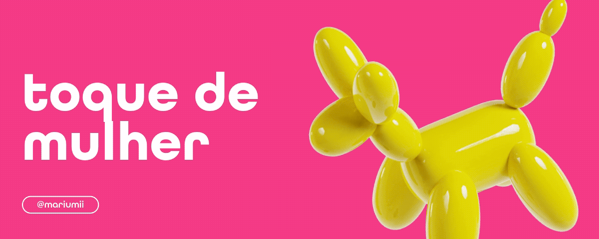

  

  
  <h1>💄 Toque de Mulher</h1>
  
<i>Transformando a beleza digital através de tecnologia e personalização.</i>

  

    
    
  

---

## 📖 Sobre o Projeto

O **Toque de Mulher** é um ecossistema digital de beleza de próxima geração. Nossa missão é oferecer mais do que produtos: entregamos uma consultoria de beleza inteligente, utilizando o que há de mais moderno no desenvolvimento web para criar uma experiência de compra imersiva, rápida e personalizada.

### ✨ Funcionalidades de Destaque
- 🤖 **Routine Builder:** Assistente inteligente que monta seu kit de cuidados ideal.
- 🌓 **Dark Mode Dinâmico:** Interface otimizada para destacar a fidelidade das cores dos produtos.
- ⚡ **Performance PWA:** Experiência de aplicativo nativo com suporte offline.
- 📊 **Beauty Specs:** Comparador técnico de atributos sensoriais e ativos.

---

## 🛠️ Stack Tecnológica

  
  
  
  
  
  

---

## 📅 Roadmap de Evolução

| Fase | Status | Descrição |
| :--- | :---: | :--- |
| **Fase 1-3** | ✅ | Estrutura Base, Auth, Design UI/UX e Protótipo Inicial. |
| **Fase 4** | 🚀 | Implementação de PWA, Offline Mode e Dashboards. |
| **Fase 5** | 🎨 | Dark Mode Dinâmico e Micro-interações (Framer Motion). |
| **Fase 6** | 🧠 | Routine Builder e Comparador Inteligente (Beauty Tech). |
| **Fase 7** | 🏆 | Programa de Fidelidade Gamificado (Tiered Loyalty). |

---

## 👥 Nosso Time

Conheça as mentes brilhantes por trás do **Toque de Mulher**:

<table align="center">
  <tr>
    <td align="center">
      <a href="https://github.com/Marichoii">
         
        <b>Maria Eduarda</b>
      </a> 
      👑 Product Owner / Design
    </td>
    <td align="center">
      <a href="https://github.com/MatheusMusashiTanaka">
         
        <b>Matheus Musashi</b>
      </a> 
      💻 Tech Lead / Backend
    </td>
    <td align="center">
      <a href="https://github.com/joaodelabio">
         
        <b>João Gabriel</b>
      </a> 
      🛠️ Fullstack Developer
    </td>
  </tr>
  <tr>
    <td align="center">
      <a href="https://github.com/Jpzin1">
         
        <b>João Pedro</b>
      </a> 
      📱 PWA / Frontend
    </td>
    <td align="center">
      <a href="https://github.com/GuHenriquee">
         
        <b>Gustavo Henrique</b>
      </a> 
      📊 Backend / Data
    </td>
    <td align="center">
      <a href="https://github.com/ccarolmdlima">
         
        <b>Carolina</b>
      </a> 
      🎨 Frontend / UI
    </td>
  </tr>
  <tr>
    <td align="center" colspan="3">
      <a href="https://github.com/Zouares">
         
        <b>Gabriel Soares</b>
      </a> 
      🖌️ UI/UX Designer
    </td>
  </tr>
</table>

---

## 🤝 Como Contribuir

1. Faça um **Fork** do projeto.
2. Crie uma **Branch** para sua feature (`git checkout -b feature/NovaFeature`).
3. Faça o **Commit** de suas alterações (`git commit -m 'Add: Nova Feature'`).
4. Envie para a Branch (`git push origin feature/NovaFeature`).
5. Abra um **Pull Request**.

---

  Desenvolvido com ❤️ pela equipe Toque de Mulher. © 2026

