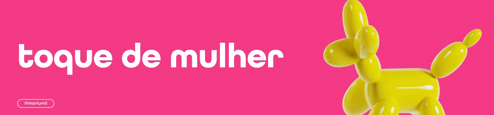

  

  
  

    
    
    

---

## Sobre o projeto

O **Toque de Mulher** é um ecossistema digital focado em beleza, experiência do usuário e personalização. Nosso objetivo é conectar tecnologia e cuidado pessoal em uma plataforma moderna, intuitiva e escalável.

## Repositórios principais

- **Frontend:** interface e experiência da plataforma.
- **Backend:** APIs, regras de negócio e integrações.
- **Docs:** documentação central do projeto, guias e materiais de apoio.

## Documentação

Toda a documentação do projeto está centralizada no repositório [`docs`](https://github.com/ToqueDeMulher/docs).

Lá você encontra materiais como:

- visão geral do projeto;
- organização técnica;
- fluxos e processos;
- orientações para desenvolvimento e colaboração.

## Stack

  
  
  
  
  

## Time

<table align="center">
  <tr>
    <td align="center">
      <a href="https://github.com/Marichoii">
         
        <b>Maria Eduarda</b>
      </a> 
      Product Owner / Design
    </td>
    <td align="center">
      <a href="https://github.com/MatheusMusashiTanaka">
         
        <b>Matheus Musashi</b>
      </a> 
      Tech Lead / Backend
    </td>
    <td align="center">
      <a href="https://github.com/joaodelabio">
         
        <b>João Gabriel</b>
      </a> 
      Fullstack Developer
    </td>
  </tr>
  <tr>
    <td align="center">
      <a href="https://github.com/Jpzin1">
         
        <b>João Pedro</b>
      </a> 
      PWA / Frontend
    </td>
    <td align="center">
      <a href="https://github.com/GuHenriquee">
         
        <b>Gustavo Henrique</b>
      </a> 
      Backend / Data
    </td>
    <td align="center">
      <a href="https://github.com/ccarolmdlima">
         
        <b>Carolina</b>
      </a> 
      Frontend / UI
    </td>
  </tr>
  <tr>
    <td align="center" colspan="3">
      <a href="https://github.com/Zouares">
         
        <b>Gabriel Soares</b>
      </a> 
      UI/UX Designer
    </td>
  </tr>
</table>

## Como contribuir

1. Faça um fork do projeto.
2. Crie uma branch para sua feature.
3. Realize suas alterações e commits.
4. Envie sua branch para o GitHub.
5. Abra um Pull Request.

---

  Desenvolvido pela equipe Toque de Mulher.

